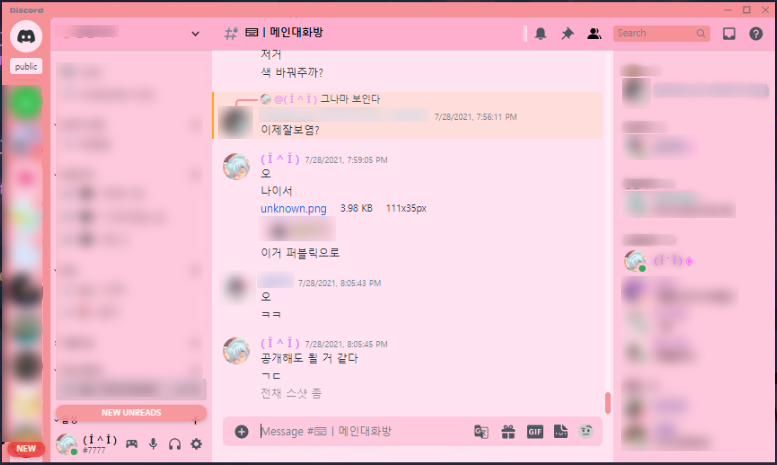
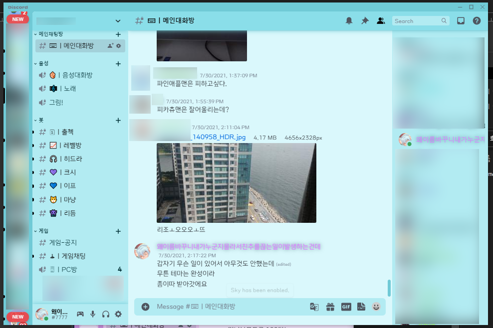
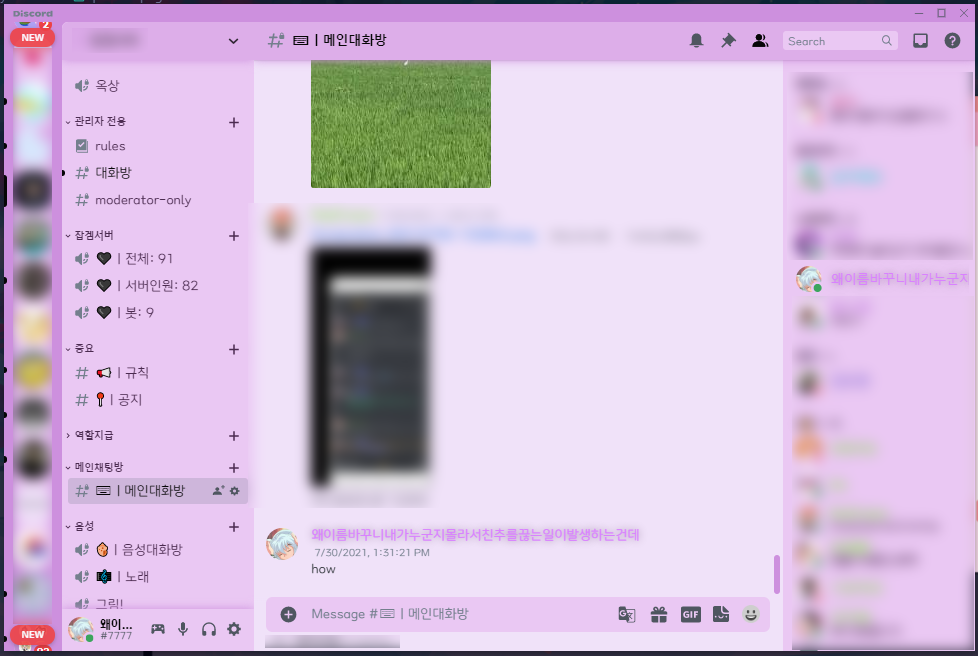
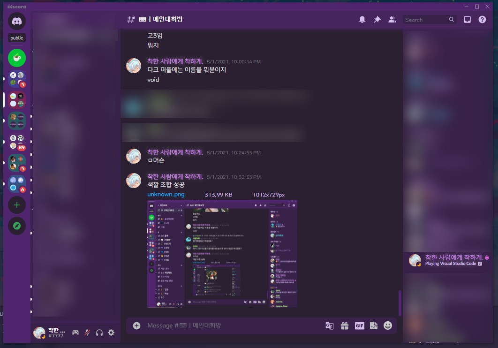

# Discord Qwreey's Color Themes

## PREVIEW

### cherryBlossom theme

벚꽃색 테마 / Order: 상아리  
  

### sky theme

하늘색 테마 ~~사실 민트에 가깝다~~ / Order: ! ＰＬＹＵＲＳＲ ! (aka '남자에요', '존경이')  
  

### lilac theme

라일락 테마 / qwreey75 (yes, is me)  
  

### void theme

보이드 테마 / ???? (unknown)  
  

## KOREAN - 읽어줘.적용법

~~주의 !! : 이 테마는 다크 테마에 호환되지 않습니다, 라이트 테마로 바꾸어 주세요 ! (글자 색깔을 맞추기 위함)~~  
이제 더이상 라이트 테마로 맞출 필요가 없습니다, 이제 자동으로 라이트 테마 css 를 :root 에 덮어씁니다

먼저 [더나은 디스코드](https://betterdiscord.app) 를 받고 난 뒤  
설정에 들어가서 Themes 를 찾습니다 (Better Discord 새션에 있음)  

  

이제 여기에서 'Open Theme Folder' 를 누르고  
(만약 폴더가 열리지 않는다면 윈도우키+R %AppData%\BetterDiscord\themes 입력 후 엔터)  
뜨는 해당 폴더 안에 [릴리즈 탭](https://github.com/qwreey75/Themecord/releases) 에서 받은 '테마이름.theme.css' 파일을 집어넣고  
디스코드로 들어가서 테마를 켜주면 끝!  

