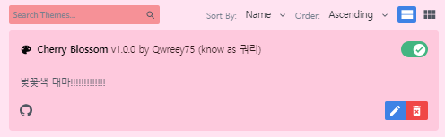

# Discord Cherry Blossom Theme

## PREVIEW

## KOREAN - 읽어줘.맠다운문서

먼저 [더나은 디스코드](https://betterdiscord.app) 를 받고 난 뒤  
설정에 들어가서 Themes 를 찾습니다 (Better Discord 새션에 있음)  

  

이제 여기에서 'Open Theme Folder' 를 누르고  
뜨는 해당 폴더 안에 [릴리즈 탭](https://github.com/qwreey75/CherryCord/releases) 에서 받은 'cherrycord.theme.css' 파일을 집어넣고  
디스코드로 들어가서 테마를 켜주면 끝!  

